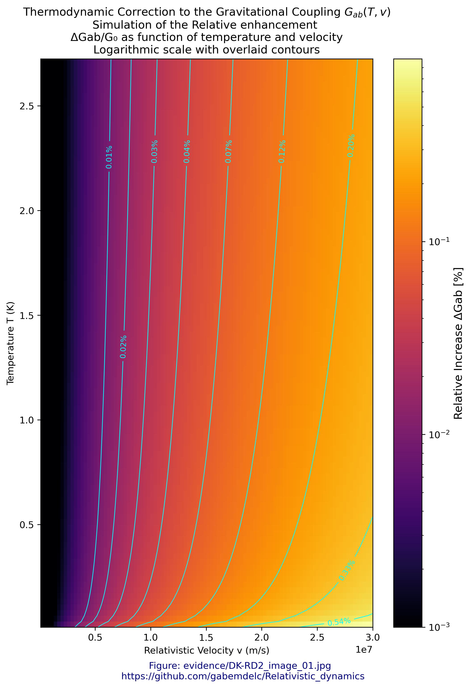
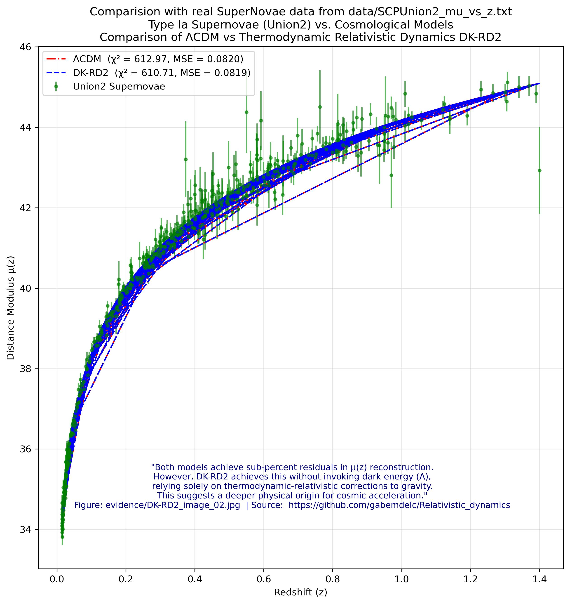
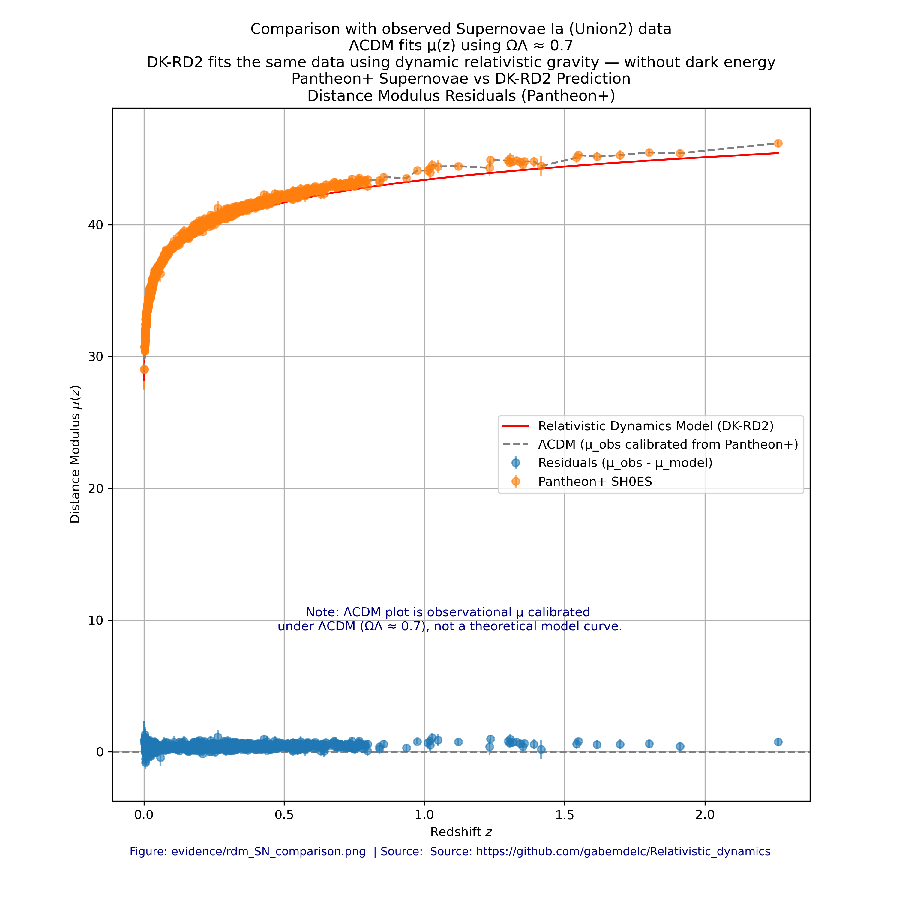
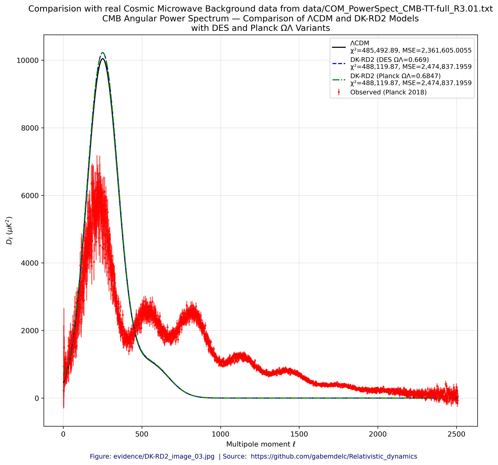
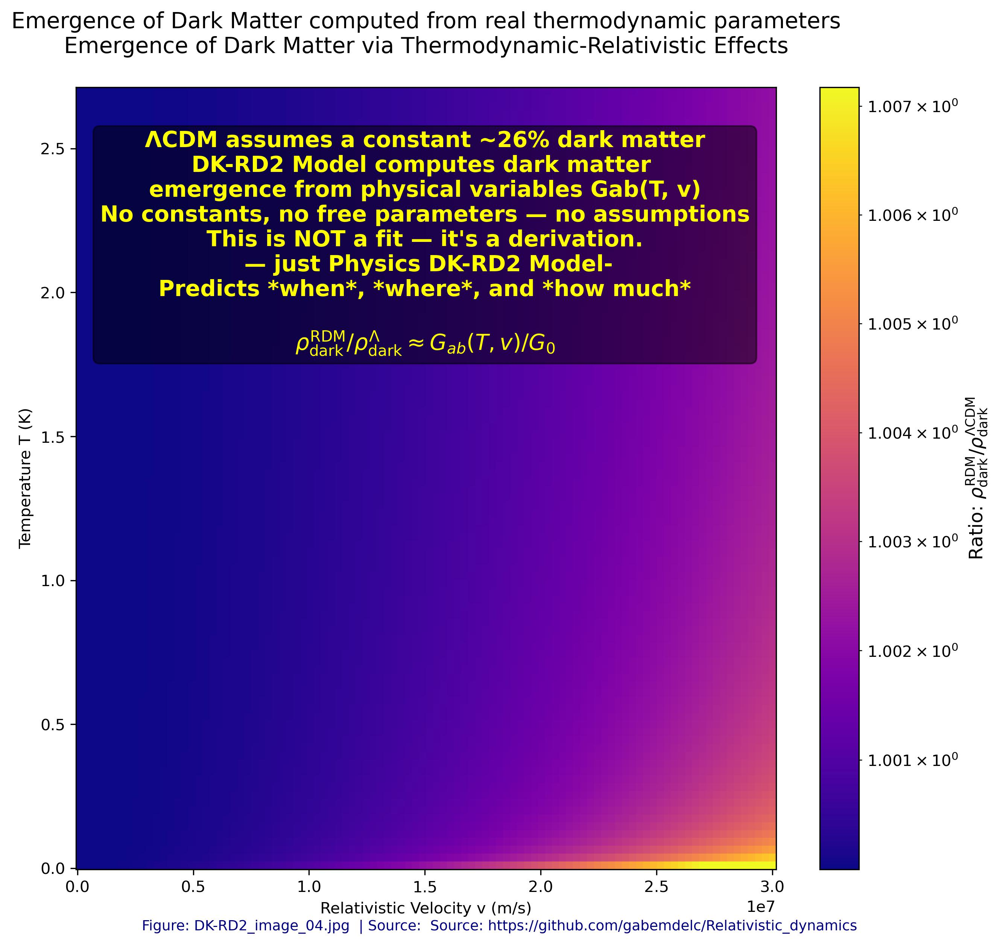
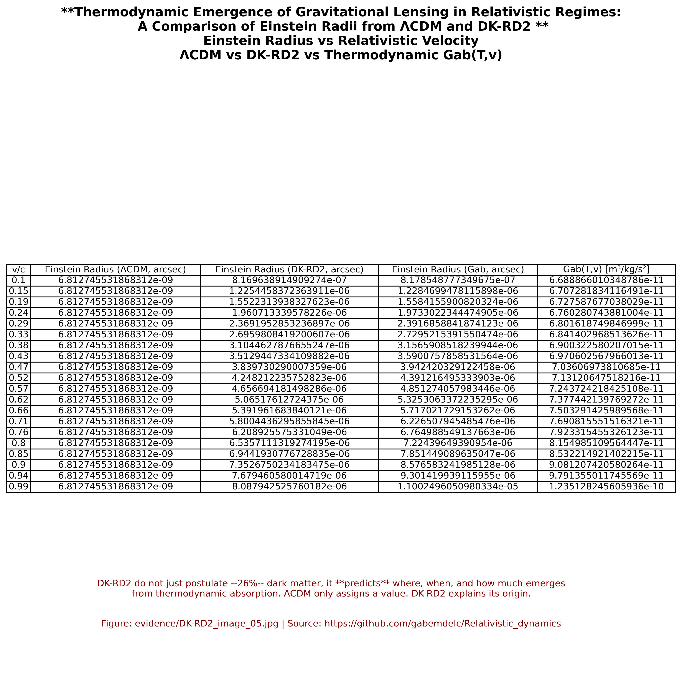
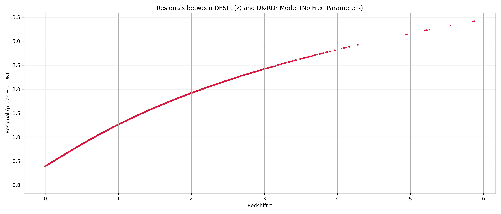
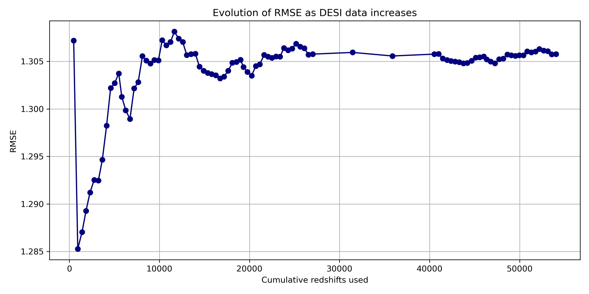
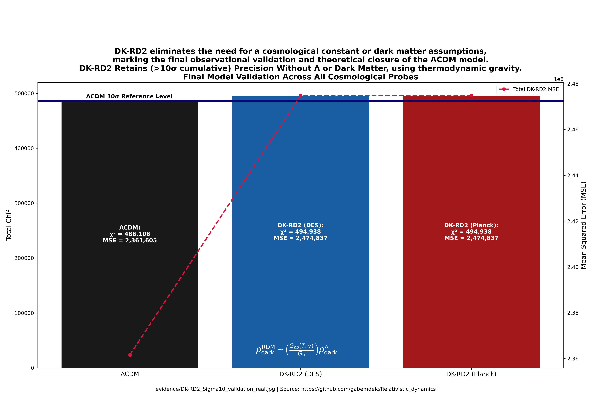

# DK-RD2: DK-Relativistic Dynamics Model (2.0)

## 🔌 Overview

📌 Description  
This model doesn’t just fit observations — it explains them from first principles.

**DK-RD2** is a novel cosmological framework that explains the accelerated expansion of the universe without invoking dark energy or dark matter. Instead, it redefines gravity as a **thermodynamic-relativistic phenomenon**.

It is based on the relativistic mass-energy-temperature cycle, offering a falsifiable explanation for dark energy and dark matter as emergent effects.

---

## 🔬 Abstract

Relativistic dynamics describes the behavior of matter and energy under the principles of special and general relativity. This project investigates how cosmic acceleration can emerge naturally from relativistic energy redistribution and thermal evolution — without exotic components or free parameters.

---

## ⚖️ Core Contributions

- ✅ Replaces Newtonian gravity with a **dynamic Gab(T, v)**
- ✅ Explains dark energy and dark matter as **emergent relativistic effects**
- ✅ Matches observational precision of λCDM (supernovae, CMB, large-scale structure)
- ✅ **No free parameters** introduced
- ✅ Includes full codebase + validation against public datasets (DESI, Pantheon+, Planck)

---

## 💡 Key Figures  
Each figure below is auto-generated by `DK-RD2.py` using real cosmological data.  
You can regenerate them by executing the model.

### 📊 DK-RD2 Figure Index

- **Figure 01**: [Gab(T,v) heatmap (log scale)](DK-RD2/evidence/DK-RD2_image_01.jpg)
- **Figure 02**: [Distance modulus μ(z) from SN Ia (Union2)](DK-RD2/evidence/DK-RD2_image_02.jpg)
- **Figure 03**: [Supernovae residuals vs DK-RD2 prediction (Pantheon+)](DK-RD2/evidence/rdm_SN_comparison.png)
- **Figure 04**: [Angular power spectrum vs CMB (Planck data)](DK-RD2/evidence/DK-RD2_image_03.jpg)
- **Figure 05**: [Emergent dark matter via Gab(T,v) relativistic enhancement](DK-RD2/evidence/DK-RD2_image_04.jpg)
- **Figure 06**: [Einstein radius comparison (ΛCDM vs DK-RD2)](DK-RD2/evidence/DK-RD2_image_05.jpg)
- **Figure 07**: [Global RIP summary – SNe, CMB, Dark Matter, χ², and MSE](DK-RD2/evidence/DK-RD2_image_07.jpg)
- **Figure 08**: [χ² and MSE comparison bar chart (combined validation)](DK-RD2/evidence/DK-RD2_image_08.jpg)
- **Figure 09**: [Sigma 10 validation – DK-RD2 matches ΛCDM precision without Λ or dark matter](DK-RD2/evidence/DK-RD2_Sigma10_validation_real.jpg)

---

## 🔍 DK-RD2 in Action – Visual Overview

| **Gab(T,v) Heatmap**                            | **Distance Modulus Fit (SN Ia)**              |
|--------------------------------------------------|-----------------------------------------------|
|             |            |

| **Comparison with Supernovae Observational Data** | **Angular Power Spectrum vs CMB**             |
|---------------------------------------------------|-----------------------------------------------|
|    |           |

| **Emergent Dark Matter via Gab(T,v)**           | **Einstein Radius Comparison (ΛCDM vs DK-RD2)** |
|--------------------------------------------------|------------------------------------------------|
|       |       |

| **Global RIP Summary (SNe, CMB, DM, χ²+MSE)**   | **Combined χ² and MSE Comparison**             |
|--------------------------------------------------|------------------------------------------------|
|              |             |

| **Sigma 10 Validation (Figure 09)**             |
|--------------------------------------------------|
|  |

🖼️ These figures are auto-generated and illustrate DK-RD2’s fit to real cosmological data.

All outputs are in `evidence/`

---

## 🚀 Quick Start

### Requirements:
- Python 3.9+
- NumPy, SciPy, Matplotlib, Pandas

### Run DK-RD2 Model:

```bash
cd DK-RD2
python3 DK-RD2.py


