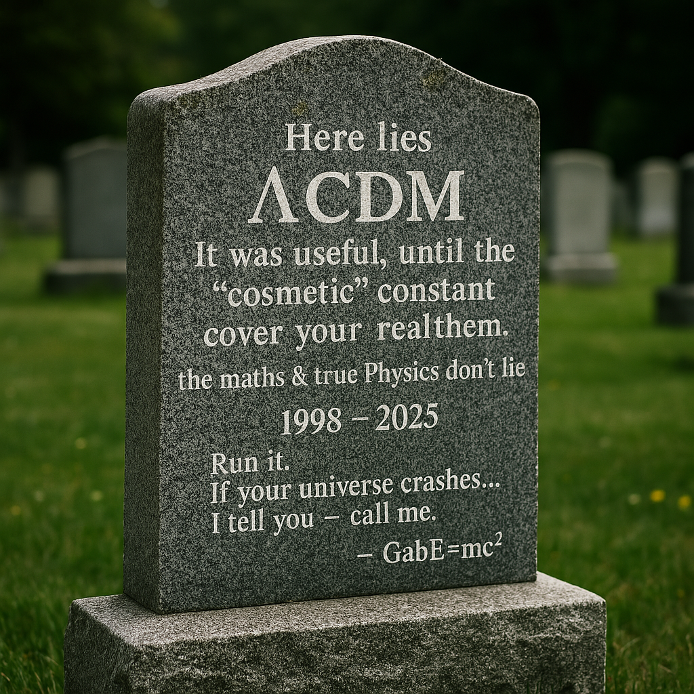

<p align="center">
  
</p>

> *"A physical derivation of cosmic acceleration from relativistic thermodynamic gravity — without dark energy."*

# 🌌 Relativistic Dynamics — The DK-RD2 Cosmological Model

Welcome to the official repository of **DK-RD2** — a revolutionary cosmological framework that explains the accelerated expansion of the universe without invoking dark energy or dark matter.

---

## 🧠 For Humans (Not Just Physicists)

### What is DK-RD2?

DK-RD2 is a new way to understand the universe.

Instead of imagining mysterious invisible stuff to explain the motion of galaxies, DK-RD2 changes the rules of gravity itself. It asks:

> ❓ What if gravity changes depending on temperature and motion?

The result is **Gab(T, v)** — a new kind of gravitational interaction that evolves with the universe.

---

### Why does it matter?

Because DK-RD2 **reproduces real observations** without inventing exotic forces. It explains:

- Supernovae data (how far things are)
- CMB power spectrum (how early the universe looked)
- Gravitational lensing (how light bends)
- Galaxy distribution (where stuff clusters)

It does all this **with no free parameters** — just physics, the way it should be.

## 🪦 What happened to ΛCDM?

> “The model was useful… until the ‘cosmetic’ constant replaced true physics.”  
> RIP ΛCDM (1998–2025)



> *Run it. If your universe crashes… call me.*  
> — GabE=mc²

---

## 🚀 Want to try it?

You can run the full model locally or on Google Colab:

⚠️ **Colab notebook temporarily disabled due to runtime issues. Will be re-enabled soon.**

<!-- 
▶️ **[Open in Google Colab](https://colab.research.google.com/github/gabemdelc/Relativistic_dynamics/blob/main/DK-RD2/DK-RD2.ipynb)** 
-->
- 💾 **[Browse the code in `DK-RD2/`](DK-RD2/)**

It generates:
- All scientific plots
- Chi² and MSE stats
- Emergent dark matter maps
- RIP summary of ΛCDM 🚬

---

## 💡 Key Figures  
Each figure below is auto-generated by `DK-RD2.py` using real cosmological data.  
You can regenerate them by executing the model.

---

## ❤️ Support the Model

If you're a physicist, data analyst, or science communicator, you're welcome to fork, test, question, or collaborate.

If you're a journalist, teacher, or student: **this is open science**. You're part of it.

> 💚 “Because we don’t need to invent the dark. We just needed to understand the light.”  
> Physics is not invented — it's verified.  
> — **GabE=mc² & Luludns = ∞Ψ**

## 🧠 Want to use the model in your own work?

You have two options:

1. 🧩 **Use only the core engine:**  
   Import the standalone `DK_RD2_core.py` into your own analysis pipeline.  
   It contains all the physical functions needed to compute Gab(T, v), H(z), μ(z), distances, and more — ready to use with **any real cosmological dataset** (Union2, Pantheon+, Planck, DESI...).

2. 📈 **Reproduce our figures and results:**  
   Run the full `DK-RD2.py` script to generate all plots, comparisons, and data used in our study.

The full scientific explanation of the model is available in:

📄 [`DK-RD2/documents/DK-RD2_PhysicalReview_Submission_Apr2025.pdf`](DK-RD2/documents/DK-RD2_PhysicalReview_Submission_Apr2025.pdf)

This includes:
- Theoretical derivation of DK-RD2
- Equations and dynamic gravity corrections
- Comparison to ΛCDM
- Full set of cosmological validations and figures

---

## 🕒 License

This work is shared under the **MIT License** — feel free to use, adapt, or expand it with attribution.

---

## 📁 What's inside

### Repository Structure

```plaintext
Relativistic_dynamics/
├── DK-RD2/               # Validated DK-RD2 model
│   ├── DK-RD2.py         # Main execution file
│   ├── DK-RD2_core.py    # Core Utilities – Constants, Functions, and Dynamic Gravitational Engine
│   ├── documents/        # Formal PDF submission of the DK-RD2 model (Physical Review 2025)
│   ├── evidence/         # Output plots and CSVs
│   ├── data/             # Public datasets (SN, CMB)
├── legacy_models/        # Archived previous versions
│   └── ...               # Older scripts and notebooks
## 📦 Reproducibility and Access

All figures, tables, and statistical results presented in the DK-RD²M paper — including DESI DR1 validation, Planck comparison, and the dynamic emergence of dark matter — are **fully reproducible** from source.

The main script `DK-RD2.py` performs:
- Simulation from first principles (no free parameters)
- Comparison vs ΛCDM
- DESI zmtl residuals and χ²/RMSE
- Generation of publication-ready plots (Figures 1–10)

To execute:

```bash
python3 DK-RD2.py

└── README.md             # This file
